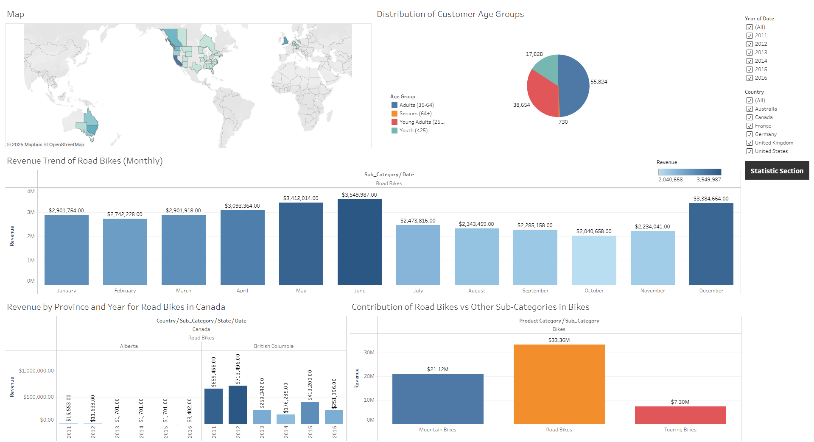
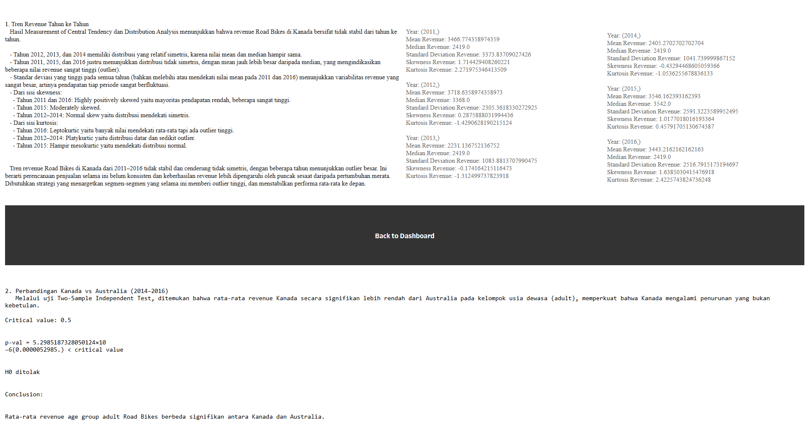

# Judul Project

**Road-Bikes-Revenue-Strategy**

## Repository Outline

Berikut ini adalah struktur isi repository beserta deskripsi singkat tiap file:

```
1. README.md - Penjelasan gambaran umum project
2. notebook.ipynb - Notebook yang berisi pengolahan data dengan python
3. dataset.csv - Dataset yang digunakan untuk analisis
4. ss-dashboard.png dan ss-dashboard-2.png - Screenshoot Dashboard
```

## Problem Background

Selama periode 2014 hingga 2016, Kanada secara konsisten mencatatkan total revenue terendah dibandingkan negara-negara lain dalam dataset. Meskipun terjadi peningkatan signifikan pada total revenue global di tahun 2015, performa Kanada tidak menunjukkan pertumbuhan yang sebanding. Bahkan pada tahun 2016, total revenue Kanada kembali menurun, meskipun tidak serendah tahun 2014.

Salah satu sub-kategori yang berperan penting dalam penjualan di Kanada adalah Road Bikes. Namun, penjualannya juga mengalami fluktuasi dan belum mencapai potensi optimalnya. Melihat hal ini, peningkatan revenue _Road Bikes_ di Kanada pada tahun 2017 menjadi fokus strategis untuk mendorong pertumbuhan penjualan secara keseluruhan di negara tersebut.

## Project Output

Output dari project ini berupa **dashboard interaktif menggunakan Tableau** yang menyajikan analisis dan insight penjualan Road Bikes di Kanada.

## Data

Dataset yang digunakan berjudul **"Bike Sales in Europe"** dan diambil dari Kaggle. Dataset ini memiliki 18 kolom dan mencakup informasi penjualan di berbagai negara dan negara bagian. Beberapa karakteristik dataset:

- Jumlah kolom: 18
- Tidak terdapat missing value (sudah bersih)
- Kolom utama: `Revenue`, `Product`, `Customer Gender`, `Country`, dll
- Insight yang dihasilkan mencakup penjualan berdasarkan gender, produk, dan lokasi geografis

## Method

Metode analisis yang digunakan dalam project ini mencakup:

- Statistik deskriptif
- Visualisasi data menggunakan Python dan Tableau
- Analisis tren penjualan dan segmentasi konsumen

## Stacks

Beberapa tools dan library yang digunakan dalam project ini:

- **Python**
  - `pandas` - manipulasi dan analisis data
  - `seaborn` - membuat visualisasi chart
  - `matplotlib` - membuat visualisasi seperti pie chart
  - `scipy` - analisis statistik
- **Tableau** - membuat dashboard visualisasi interaktif

## Reference

- [Dataset: Bike Sales in Europe - Kaggle](https://www.kaggle.com/datasets/sadiqshah/bike-sales-in-europe)
- [Dashboard Tableau](https://public.tableau.com/views/P0M1_fadhola_asandi_dashboard/Dashboard1?:language=en-US&publish=yes&:sid=&:redirect=auth&:display_count=n&:origin=viz_share_link)

## Screenshoot Dashboard




---

**Referensi tambahan:**

- [Basic Writing and Syntax on Markdown](https://docs.github.com/en/get-started/writing-on-github/getting-started-with-writing-and-formatting-on-github/basic-writing-and-formatting-syntax)
- [Contoh readme](https://github.com/fahmimnalfrzki/Swift-XRT-Automation)
- [Another example](https://github.com/sanggusti/final_bangkit) (**Must read**)
- [Additional reference](https://www.freecodecamp.org/news/how-to-write-a-good-readme-file/)
